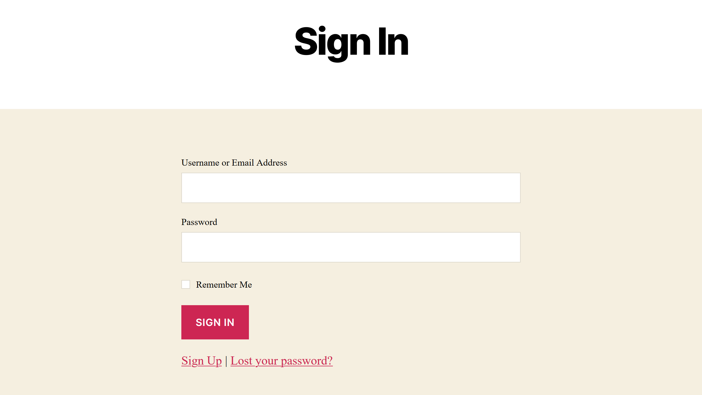

# Login Flow

Just another login flow plugin.



## STRUCTURE
```
├── admin
│   ├── partials
|   |   └── login-flow-admin-display.php
│   ├── class-login-flow-admin.php
│   └── index.php
├── classes
│   ├── class-login-flow-activator.php
│   ├── class-login-flow-deactivator.php
│   ├── class-login-flow-errors.php
│   ├── class-login-flow-i18n.php
│   ├── class-login-flow-loader.php
│   ├── class-login-flow-redirects.php
│   ├── class-login-flow-register.php
│   ├── class-login-flow-render.php
│   ├── class-login-flow-reset-password.php
│   ├── class-login-flow-uninstallator.php
│   ├── class-login-flow.php
|   └── index.php
├── languages
|   └── login-flow.pot
├── public
│   ├── class-login-flow-public.php
|   └── index.php
├── templates
│   ├── password-lost.php
│   ├── password-reset.php
│   ├── sign-in.php
|   └── sign-up.php
├── index.php
├── LICENSE
├── login-flow.php
├── README.md
└── readme.txt
```

## BASED ON
- [WordPress Plugin Boilerplate](https://github.com/DevinVinson/WordPress-Plugin-Boilerplate)

## CONTRIBUTOR
Oleksandr Klochko [@utoyvo](https://github.com/utoyvo).

## LICENSE
Code released under the [GPLv3.0](LICENSE).
